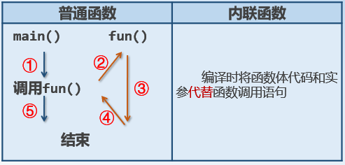

## 第三章 函数的区别及new和delete       

[TOC]

---

### 3.1 函数的区别  
#### 3.1.1 原型声明  
- 函数原型包括原型定义和原型声明两种    
```C++
// 函数原型定义
int max(int aX, int aY){
    return aX>aY?aX:aY;
}
// 函数原型声明
int max(int aX, int aY);
int max(int, int);
```

- 函数要先定义再使用，如果先使用后定义则必须使用原型声明：**返回值类型 函数名(形参列表);
**  

```C++
#include <iostream>
using namespace std;
int main(void){
    float add(float x,float y); // 原型声明
    float a,b,c;
    cout << "Please enter a,b:";
    cin >> a >> b;
    c = add(a, b);
    cout << "sum=" << c << endl;
    return 0;
}
float add(float x,float y){
    return x+y;
}
```

- 注意 
	- 声明语句必须加分号！  
	- 位置任意，只是作用域不同  
	- 声明的原因就是告诉编译环境函数参数的个数,类型和顺序  
	- C和C++中，任何类型的函数先使用后定义都需原型声明！  
	- 如果函数定义在使用之前，那么函数的定义也即函数的声明  
	- 原型形参为空的含义不同:   
```C++
void  fun();
void  fun(void);
//C++: 认为两种形式都无参
//C ：认为第一个可能有多个参数,第二个无参
```

#### 3.1.2 局部变量定义的位置  
- 区别：局部变量定义的位置    
- C：形参表或者函数体的最上面   
- C++：形参表或者随用随定义(推荐)  
```C++
#include <iostream>
using namespace std;
int main(void){
    int ival = 3;
    int ival1 = 4;
    cout << ival << endl;
    cout << ival1 << endl;
    return 0;
}

#include <iostream>
using namespace std;
int main(void){
    int ival = 3;
    cout << ival << endl;
    int ival1 = 4;
    cout << ival1 << endl;
    return 0;
}
```
#### 3.1.3 域解析::扩大全局变量的可见范围  
- 区别：域解析::扩大全局变量的可见范围  
```C++
int sum = 5050;
int main(void)
{
    int arr[3], i;
    cout << "input 3 num:" << endl;
    for(i=0;i<3;i++)		cin >> arr[i]; 
    int sum = 0;
    for(i=0;  i<3;  i++)	sum += arr[i];
    for(i=0; i<3; i++)		
    	cout << setw(4) << arr[i] << endl;
    cout << "局部sum=" << sum << endl;
    ::sum += sum;
    cout << "全局sum=";
    cout << ::sum <<endl;	//在这里::是一元运算符

    return 0;
}
```
#### 3.1.4 带默认参数的函数  
- 区别：形式参数可以有默认值   
```C++
#include <iostream>
using namespace std;
void fun(int i, int j=5, int k=10);
// 实际参数优先  
int main(void){
    fun(20);
    fun(20,30);
    fun(20,30,40);
    return 0;
}
void fun(int i,int j,int k){
    cout << "i=" << i << "j=" << j
      << "k=" << k << endl;
}
```

- 注意：  
	- 有默认参数值的参数必须在参数表的最右端   
		- `int f(int a,int b=0,int c);  // error`
	- 必须在函数调用前将默认值通知编译系统
	- 声明和定义同时给出默认值，有些编译器报错，有些不会最好只在函数声明时给出默认值
	- C和C++函数参数的差别：

情况|C|C++
-|-|-  
形参有默认值 | NO | YES  
实参、形参个数 | == | <=  


#### 3.1.5 内联函数  
1. 调用方式   
   
2. 定义方法：在函数最左端加 inline   
```C++
#include <iostream>
using namespace std;
inline int max(int a,int b, int c);
int main(void){  
    int i=10,j=20,k=30,m;
    m = max(i,j,k);
    cout<<"max="<<m<<endl;
    return 0;
}
int max(int a, int b, int c){
    if(b>a)		a = b;
    if(c>a) 	a = c;
    return a;
}
```

- 注意：   
	- 可在定义和声明函数时同时写inline,也可在一处写inline  
	- 只将规模很小且使用频繁的函数定义成内联函数  
	- 内联函数中不能包含复杂的控制语句  
	- 对函数作inline声明是建议性的，并非一经指定为inline就一定当内联函数处理  
	- 类内定义的成员函数都将理解为inline，前面无需加inline  
	- 类内声明，类外定义的函数默认并非inline  
#### 3.1.6 函数重载  
- 在相同作用域内，用同一函数名定义的多个函数，这些函数的参数个数、参数类型和顺序不同  
- 重载的前提：发生在同一个作用域中的才是重载，因为C++中函数中局部声明的名字将屏蔽在全局作用域内声明的名字！  
```C++
#include <iostream>
using namespace std;
int a = 0;
int main(void){
   int a = 1;
   cout << "a = "<<a <<endl;
   return 0;
}
```
```C++
#include <iostream>
using namespace std;
int square(int x){
    return x*x;
}
float square(float x){  
    return x*x; 
}
double square(double x=1.5){
    return x*x;
}
int main(void){  
    cout<<"square()" <<square()<<endl;
    cout<<"square(10)" <<square(10)<<endl;
    cout<<"square(2.5f)" <<square(2.5f)<<endl;
    cout<<"square(1.1)" <<square(1.1)<<endl;
    return 0;
}
```

- 注意：  
	- 重载函数的参数个数，参数类型，参数顺序3者中必须至少有一种不同，返回值不同不作为重载依据  
	- 重载函数的功能应该相近  
	- main()函数不能重载  
	- 在调用重载函数时，参数类型最好保证一致，不一致会自动转换但转换不成功会报错    
	- 重载与有默认值的函数一起用，可能产生二义性  
```C++
#include <iostream>
using namespace std;
int fun(int x, int y=10) {
    return x*y;
}
int fun(int x){
    return x;
}
int main(void){  
    fun(5);                    
    return 0;
}
```

- 有些看起来不同的形参表本质上是相同的   
```C++
	double lookup(double acct);
	double lookup(double  Account );  // 忽略参数名
	typedef unsigned int Uint;
	float lookup(unsigned int);
	float lookup(Uint);  // unsigned int and int类型相同
```

- 类型相近的重载函数确定最佳匹配的依据由高到低为：  
```C++
// 1. 精确匹配（exact match）   
// 2. 类型提升 ( promotion )   
//      a. 整型提升：所有比int小的整型（char、 short、bool），如果该类型所有可能值均包含在int内则提升为int；否则提升为unsigned int（有符号与无符号类型转换规则)。  
//      b. float到double的类型提升：
	void ff(int);		// 任何整型的实参，int型总是优于short型
	void ff(short);
	void ff(double ival);

	ff('a');    		// 调用ff(int)
	short sival = 5; 	// 若此处为long型，也将调用ff(int)
	ff(sival);  // 调用ff(short)
	ff(3.14f);  // 调用ff(double)

// 3. 标准转换 ( standard conversion ):包括int→double，double→int，double→long double，T*→void*等合法隐式类型转换
	void ff(long double ival) {  
    	cout << "long double" << endl; 
	}

	void ff(int sival){
    	cout << "int" << endl; 
	}
	int main(void) {
    	ff(3.14); // 产生二义性 不知道执行 ff(int(3.14))还是 ff(long double(3.14))
    return 0;
	}
// 4. const可以作为重载的依据:仅当形参是引用或者指针时，const才能作为重载的依据，普通的const对象不能作为重载的依据！  
	void ff( int );
	void ff( const int );  // 不能作为重载依据

	void ff( int* );
	void ff( const int* ); // 可以作为重载依据

	void ff(int&);
	void ff(const int&);   // 可以作为重载依据
```
### 3.2 new和delete  
- new运算符  
	- 作用： 给初始化单个对象  
	- 语法： new  数据类型;  
	- 例：  
		- int * p = new  int;  
		- int * q = new  int(100);  
- new运算符特点  
	- 自动计算类型所占空间大小  
	- 自动确定返回指针类型，不需要类型转换  
	- 可以在分配内存的同时初始化无名对象  
	- 必需用delete释放分配的空间  
- new[]运算符  
	- 作用：初始化对象数组  
	- 语法：new 类型[元素个数];  
	- 分配的空间必需用delete[]来释放  
	- 例：  
		- int * p = new  int[10];   
			 int n;  		// size_t n;  
		- int * q = new  int[n];  
		- delete []p;  
		- delete []q;   
- delete运算符  
	- 作用： 释放由new运算符分配的堆区空间  
	- 用法： delete  指针变量名;  
	- 例:     int * ptr = new int(5);  
    	- delete ptr;  
- delete []运算符  
	- 作用： 释放由new []运算符分配的堆区空间  
	- 用法： delete []指针变量名;  
	- 例:    `int *ptr = new int[10];`   
	- delete []ptr;  
- 注意：  
	- C++中要使用new和delete，不要与malloc()，calloc()，free()混用  
	- new和delete配对使用，否则产生内存垃圾！  
	- `int *p = new int[10]; delete p;` //则只能释放第一个, 后面的9个都无法释放,产生运行时错误！！（内存泄漏）正确的形式为delete []p;  
	- 在delete只是释放指向的内存而非释放自己的内存单元    
#### 3.2.1 异常处理  
- 异常   
	- 与期望结果不同的，可被发现和处理的错误都称为异常  
- 异常处理过程  
	- 检测异常(try)	--->   抛出异常(throw) ---> 捕捉异常(catch)   
- 语句格式：  
```C++
	throw  [<Expression>];  
	try{被检测语句} 
 	catch( 类型 [变量] )  {异常处理语句}
 	catch( 类型 [变量] )  {异常处理语句}
 	catch( … )  {异常处理语句}
```
```C++
#include <iostream>
using namespace std;
int divide(int x,int y){
    if(y == 0)
        throw  y;
    return x/y;
}
int main(void) {  
    int a = 10,b = 5,c = 0;
    try {
        cout<<"a/b="<<divide(a,b)<<endl;
        cout<<"b/a="<<divide(b,a)<<endl;
        cout<<"a/c="<<divide(a,c)<<endl;
        cout<<"c/b="<<divide(c,b)<<endl;
    }
    catch(int) {
        cout << "except of divide "
             << "zero" << endl;
    }
    cout << "calculate finished" << endl;
    return 0; 
 }
```

- 注意：  
```C++
// 1. try块 和 catch块作为一个整体出现，catch块是try-catch 结构中的一部分，必须紧跟在try块之后，不能单独使用，在二者之间也不能插入其他语句。   
	try{ … … }
	cout << a << endl;  // 不能插入其他语句catch(double){ … … }
// 2. try和catch块中必须有用花括号括起来的复合语句，即使花括号只有一个语句
// 3. 一个try-catch结构中只能有一个try快，但可有多个catch块，以便与不同的异常信息匹配
	try {… …}
	catch(double) {… …}
	catch(int) {… …}
	catch(char) {… …}
// 4. catch后面括号中，一般只写异常信息的类型名catch只检查类型，而不检查他们的值
	double a,b,c;
	… …
	throw  a;
	throw  b;
	throw  c; // 三个异常类型相同
	… …
	try {… …}
	catch(double) {… …}
// 5. catch还可以指定变量名此法可使捕获异常信息时，还能利用throw抛出值  
	double a,b,c;
	… …
	throw  a;
	… …
	try
	{… …}
	catch(double t) // 可使t获得a的值
	{  cout << "throw" << t << endl;  }
// 6. 如果在catch子句中没有指定异常信息类型，而用了删节号"..."，则表示它可以捕获任何类型的异常。常放在try_catch结构的最后，相当于其他情况。  
	catch(...)
	{ cout<< "OK" << endl; }
```
