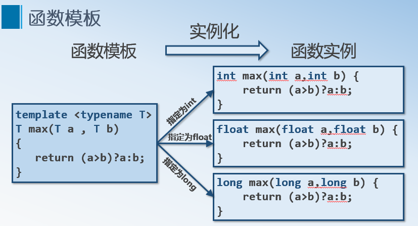

## 第17章 模板-1        

[TOC]

---
### 17.1 模板的引入  
- 为了处理不同类型的数据，我们引入了函数重载。  
```C++
int max(int a,int b) {
    return (a>b)?a:b;
}
float max(float a,float b){ 
    return (a>b)? a:b; 
}
long max(long a,long b) {
    return (a>b)?a:b;
}
char max(char a,char b) { 
    return (a>b)? a:b; 
}
```

- 这些函数的代码十分相似，差别仅参数类型的不同；如果能够把类型作为参数，就可能用另一个抽象结构产生多个功能相同但参数类型不同的函数。  
- 函数实例 → 函数模板   
```C++
template <typename T> 
T max(T a , T b) {
   return (a>b)?a:b;
}
```

- 书写样式  
```C++
	template <模板形参表>
	返回值类型  函数模板名（数据参数表）{
    	函数模板定义体
	}
	template <typename T> 
	// 模板形参前如果没有使用关键字class或typename是一个语法错误。
	T max(T a , T b){
   		return ( a > b ) ? a : b;
	}
	// 调用  
	max<int>(1,2);
	max<double>(1.0,2.0);
	max<char>('a','b');
```

- 允许将类型作为参数的抽象结构称为泛型（Generic）。  
- 支持泛型的程序设计范型称为泛型程序设计（Generic Programming）。  
- 泛型程序设计提高了代码可重用性和规格化程度  
- 在C++中体现泛型的机制是模板（Template）  
	- 函数模板（Function Template）  
	- 类模板（Class Template）  

### 17.2 模板概述   
- 概述  
	- 所谓模板是一种使用类型参数来产生一系列函数或类的机制。  
	- 若一个程序的功能是对某种特定的数据类型进行处理，则可以将所处理的数据类型说明为参数，以便在其他数据类型的情况下使用，这就是模板的由来。  
	- 模板是以一种完全通用的方法来设计函数或类而不必预先说明将被使用的每个对象的类型。  
	- 通过模板可以产生类或函数的集合，使它们操作不同的数据类型，从而避免需要为每一种数据类型产生一个单独的类或函数。  

### 17.3 函数模板  
- 函数模板是对算法相似，但支持的数据类型不同的一组操作的提炼，以提高程序的重用性。   
```C++
template <模板形参表>
返回值类型  函数模板名(数据参数表) {
    函数模板定义体
}
```

- 类型参数表又叫模板形参表，可以是基本类型，也可以是类类型，每个模板形参都必须加上前缀class或者typename,表示可以为任意类型。  
- 函数模板中的模板形参可以用来指明函数形参的类型，函数返回值的类型及函数体内局部变量的类型。  
- 在template与函数模板的定义语句之间不能插入其他语句，否则出现编译错误。  
```C++
	template<typename T>
	//int ival; // Error
	T max(T a , T b) {  
    	return (a>b)?a:b; 
	}
```

- 函数模板与模板函数的区别在于：函数模板是模板的定义，定义中用的是通用类型参数，它代表的是一类函数。而模板函数是实实在在的函数定义，他是在编译系统遇到具体的函数调用时生成的并具有具体类型的程序代码。  
   

- 函数模板的使用方式与一般函数的使用方式类似   
	- 函数模板可以根据调用时的参数类型实例化模板函数。  
```C++
	template <class T> 
	T Max(T a , T b){  
		return (a>b) ? a : b;
	}
	int main(void) {
    	int  ival = Max<int>(100, 99); 
    	char cval = Max<char>('A', 'B');
    	double dval = Max<double>(100.10, 100.11);
    	string sval = Max<string>("sss", "ttt");
    	return 0;
	}
```
```C++
	template<typename T>
	void Swap(T& a, T& b)	{
		T temp=a; a=b; b=temp;
		}
	int main(void) {
    	int nFir = 0, nSec = 4;
    	Swap(nFir, nSec);
    	cout << nFir << " " << nSec << endl;
    	string strFir = "hello", strSec = "world";
    	Swap(strFir, strSec);
    	cout << strFir << " " << strSec << endl;
    	return 0;
	}
```

- 模板参数没有隐式转换之说，必须严格遵循模板定义的参数类型  
```C++
double add(double a, double b)
{
    return a + b;
}
int  iVal=3;
double dVal = 5.0;

// 参数可以进行隐式类型转换
	add(ival, dVal);
	add(iVal, iVal);
	add('a',20); 

	template <typename T>
	T Max(T a, T b) {
    	return a>b?a:b;
	}
	int iVal=3;
	double dVal = 5.0;
	Max(iVal, 20);
	Max(iVal, int(dVal));
	// 无法自动类型转换
	Max(iVal, dval); //Error
	Max('a',20);     //Error
```

- 模板参数可以包含多个类型。  
	- 如果一个函数模板有一个以上的模板类型参数则每个模板类型参数前面 都必须有关键字class 或typename  
	- 每个类型的作用域是从定义到模板结束  
	- 模板参数不能有默认值  
```C++
	template <class  T, typename  C>
	void display( T a, C b ) {
     	cout << a <<" " << b << endl;  
	}
	display(1, 2.5);
	display<int, char>(1, 'a');
	display<int>(1, "ddd");
```

- 模板参数甚至可以包括多个非类型参数  
- 如果模板参数是非类型参数（non-type arguments ）,这个非类型参数在模板里是常量，传入的实参必须是:   
	- 常量表达式  
	- 具有外部链接对象或函数的地址  
		- &of ;       //of是对象或函数的名字  
		- f ;            //f是函数的名字  
	- 非重载的指向成员的指针:  
		- &X::of ;   //of是类X的一个成员的名字  
```C++
	template <typename T, int size> //int size 是非类型参数   
	T* alloc()	{
		return new T[size];
	}
```

- 函数模板可以用与非模板函数一样的方式声明为inline   
```C++
	template <typename T> 
	inline T max( const T&, const T&); // 正确
	inline template <typename T>  
	T max( const T&, const T&); // 错误
	// inline说明符放在模板形参表之后，返回类型之前，不能放在关键字template之前。
```

- 函数模板的重载和普通非模板函数的重载方式是一样的。   
	- 同一个作用域内  
	- 函数参数个数不同  
	- 函数参数类型不同  
	- 函数参数顺序不同  
- 函数模板除了可以用另一个函数模板重载以外还可以用普通的非模板函数重载。  

```C++
#include <iostream>
using std::endl;
using std::cout;

template <typename T> 
T max( T a, T b) {
    return (a>b)?a:b;
}
template <typename T>
T max( T a, T b, T c) {
    T iVal = (a>b)?a:b;
    return (val>c)?iVal:c;
}
double max(double a,double b) {
    return (a>b)? a:b;
}
int main(void) {
    int iV1=1,iV2=2,iV3=3;
    double dV1 = 3,dV2 = 5;
	
    cout<<max(dV1,dV2)<<endl;
    cout<<max(iV1,iV2)<<endl;
    //cout<<max(iV1,dV2)<<endl;
    
    return 0;
}
```

- C++编译器在匹配函数时遵循以下约定:   
	- 寻找一个参数完全匹配的普通函数, 若找到, 则调用它;   
	- 寻找一个函数模板, 将它实例化成一个匹配的模板函数, 若找到, 则调用它;  
	- 试试能否找到一个函数, 经过隐式的类型转换, 对所给的参数进行匹配. 若找到了, 则调用它;  
	- 若通过上述方法找不到一个合适的函数, 则返回错误信息;  
	- 若第一步有多于一个的选择, 则函数调用将返回错误信息.  

- 总结   
	- 函数模板提供一种用来自动生成各种类型函数实例的机制，程序员对于函数接口参数和返回类型中的全部或者部分类型进行参数化(parameterize)而函数体保持不变。  
	- 函数模板是对过程的抽象。  
	- 函数模板可以最大限度的进行代码重用。  


