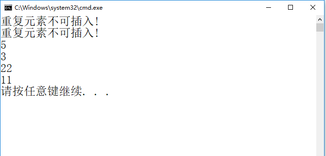
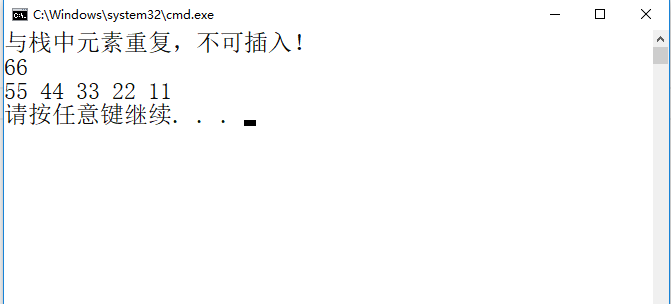
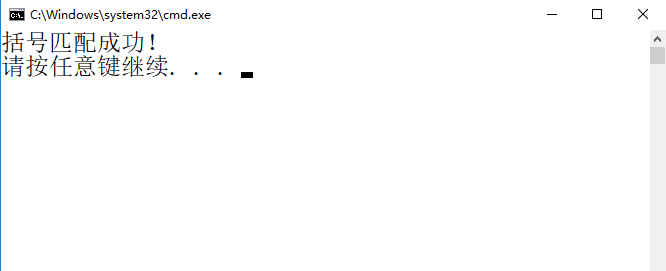
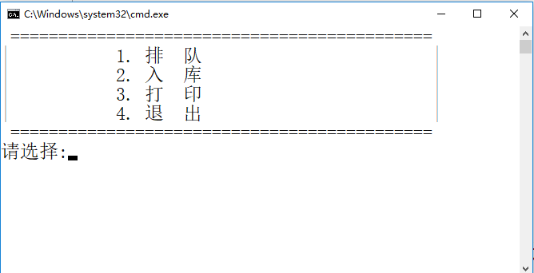

# 第三章 栈和队列  
## 1.删除栈中重复元素  
### 1.1 顺序栈  
```shell
#include <stdio.h>
#include <stdlib.h>
#define Status           int
#define OK              1
#define ERROR           0
#define STACK_INIT_SIZE 20
#define STACKINCREMENT  5
#define ElemType        int

typedef struct {
	ElemType *base;
	ElemType *top;
	int stacksize;
}SqStack;

//因为要修改栈S内存中数据成员的值，因此必须传递S的地址
Status InitStack(SqStack *S)
{

}

Status JudgRepetition(SqStack *S,ElemType e)
{
	
}

Status push(SqStack *S,ElemType e)
{
   
}

void PrintStack(SqStack S)
{

}

int main(void)
{
	SqStack s;
    ElemType *p = NULL;
	int e,i,Stat = 0;
	InitStack(&s);
	push(&s,11);
	push(&s,22);
	push(&s,3);
	push(&s,22);
	push(&s,5);
    push(&s,22);
    p = s.top - 1;
    while (p >= s.base)
    {
        printf("%d\n", *p);
        p--;
    }

	return 0;
}
```
  

### 1.2 链栈  
```shell
#include <stdio.h>
#include <stdlib.h>
#define OK          1
#define ERROR       0
#define Status      int
#define SElemType   int
//只在头部进行插入和删除
typedef struct LNode
{
	SElemType data;
	struct LNode *next;
}LNode, *LinkStack;

Status InitStack(LinkStack *S)
{

}

Status JudgRepetition(LinkStack *S, SElemType e)
{

}
Status Push(LinkStack *S, SElemType e)
{

}

void PrintStack(LinkStack S)
{

}

int main(void)
{
	LinkStack LS;
	int i = 0;
	SElemType e;
	InitStack(&LS);
	for(i = 0; i < 6; ++i){
		Push(&LS, (i + 1)*11);
	}
    Push(&LS, 11);
	Pop(&LS, &e);
	printf("%d \n", e);
	PrintStack(LS);

	return 0;
}
```
  

### 1.3 文本编辑括号识别  
```shell
#include <stdio.h>
#include <stdlib.h>
#define OK              1
#define ERROR           0
#define Status          int
#define STACK_INIT_SIZE 20
#define STACKINCREMENT  5
#define ElemType        char


typedef struct {
	ElemType *base;
	ElemType *top;
	int stacksize;
}SqStack;

//因为要修改栈S内存中数据成员的值，因此必须传递S的地址
Status InitStack(SqStack *S)
{

}

Status push(SqStack *S,ElemType e)
{

}

Status pop(SqStack *S,ElemType *e)
{

}

Status matchBracket(SqStack *S,ElemType *str)
{

}


int main(void)
{
	SqStack s;
	ElemType e;
	char str[20] = "{[(q)(a)]}<(s)>";
	matchBracket(&s,str);


	return 0;
}
```
  

## 2.插入到队列中最大值后面  

### 2.1 循环队列  
```shell
//编程建立循环队列存储结构，对汽车进停车场过程进行模拟，
//要求程序在控制台屏幕上显示菜单：
//  1.排队：输入车牌号，加入进停车队列中。 
//  2.进入：排队队列中最前面的车先进入，并将其从队列中删除。
//  3.打印：将队列中所有车辆的车牌号打印。
//  4.退出：结束系统。 
//  要求： 
//      ① 由于排队场地有限，队伍长度不超过5；  
//      ② “排队”时，若队满，提示等待；
//      ③  进入时，若队空，提示无人排队；
//      ④  所有车辆必须经过排队才能进入。
#include <stdio.h>
#include <stdlib.h>
#include <string.h>
#define   Status    int
#define     m       5
typedef    char*    QElemType;

typedef struct{
    QElemType Q[m];
    int length;
    int rear;
}SqQueue;

Status InitQueue(SqQueue *Sq)
    //构造一个空队列Q
{
   
}

Status EnQueue(SqQueue *Sq,QElemType e)
    //插入元素e为Q的新队列元素
{

}
Status DeQueue(SqQueue *Sq,QElemType *e)
    //若队列不空，则删除Q的队头元素，用e返回其值，并返回OK
    //否则返回ERROR
{
  
}

Status TraQueue(SqQueue Sq)
    //遍历输出队列的每个元素
{
   
}

int main(void)
{
    
    return 0;
}
```
运行效果：  
  


