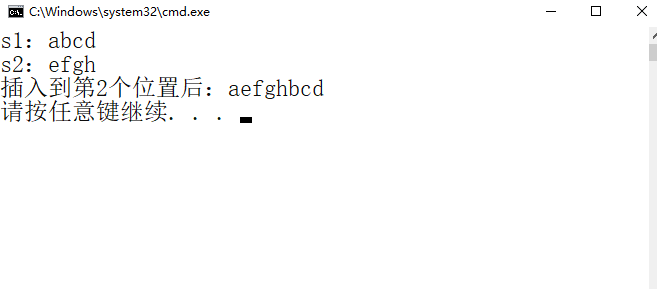
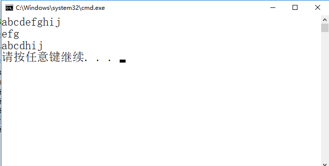

# 第四章 串  
## 1 串的定长顺序存储  
- 实现串插入操作 （不考虑截断情况）  
```shell
#include <stdio.h>
#include <string.h>

#define ERROR 0
#define OK 1
#define Status int


//串的定长顺序存储表示
#define MAXSTRLEN 255							 
typedef unsigned char SString[MAXSTRLEN + 1];	 
int StrInsert(SString *S,int pos,SString T)
{
}

void PrintStr(SString S)
{
}


int main(void)
{
    SString s1 = {4,'a','b','c','d'};
    SString s2 = {4,'e','f','g','h'};

    StrInsert(&s1,2,s2);

    PrintStr(s1);

    return 0;
}
```
运行效果：   
  

## 2 串的堆分配存储  
- 查找S中是否有与T相同的子串，有的话，删除  
```shell
#include <stdio.h>
#include <stdlib.h>
 
typedef struct {
	char *ch;	 
	int length;	 
}HString;

int StrCompare(HString S,HString T)
{
}

int SubString(HString *Sub,HString S,int pos,int len)
{

}

void PrintStr(HString S)
{

}
//查找S中是否有与T相同的子串，有的话，删除
int strfun(HString *S,HString T)
{
}

int main(void)
{
	int i;
	HString s1,T;
	s1.ch = (char *)malloc(10 * sizeof(char));
	s1.length = 10;
	for (i = 0; i < s1.length; i++)
		s1.ch[i] = 'a'+ i;
	PrintStr(s1);
	T.ch = (char *)malloc(3 * sizeof(char));
	T.length = 3;
	T.ch[0] = 'e';T.ch[1] = 'f';T.ch[2] = 'g';
	PrintStr(T);
    strfun(&s1,T);
	PrintStr(s1);

	return 0;
}
```
运行效果：   
  

## 3 模式匹配算法  

S | a  |  a	|b|	a|	b	|b|	a	|a|	b	|a	|a|	c  
-|-|-|-|-|-|-|-|-|-|-|-|-
next|0|1|2|1|2|1|1|2|3|1|1|1

P| a| a |b|a|b | c  
-|-|-|-|-|-|-
next|0|1|2|1|2|1
(1)S的next数组  
(2)P的next数组  
(3)写出KMP算法匹配过程  :


