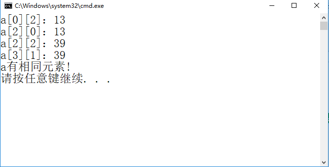
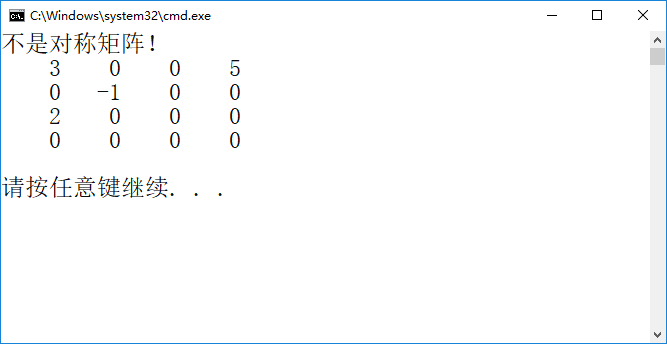
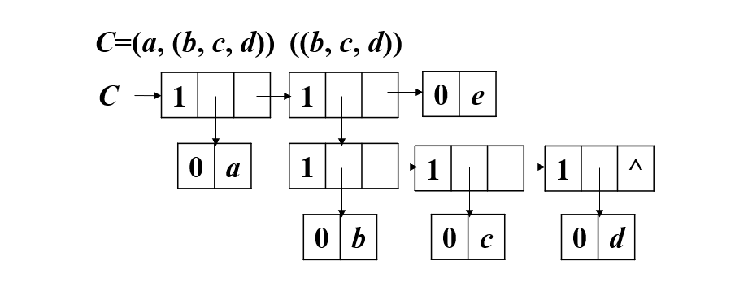
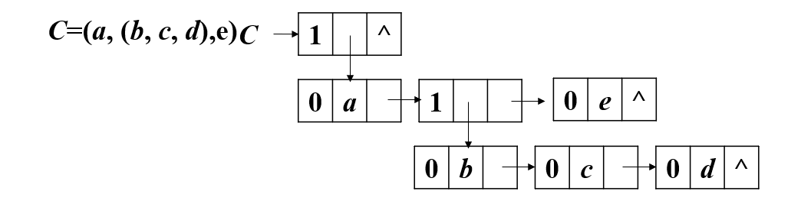

# 第五章 数组和广义表  
## 1 数组的顺序表示和实现    
### 1.1 判断一个m行n列的二维数组中是否存在相同的元素。  

```shell
#include <stdio.h>
#include <stdlib.h>

//判断一个m行n列的二维数组中是否存在相同的元素。
int ContainSameElem(int *a,int m,int n)
{
  
  
}

int main(void)
{
    int a[4][3]={11, 12, 13, 24, 25, 26, 13, 38, 39, 40, 39, 42};

    if(ContainSameElem(*a,4,3))
        printf("a有相同元素!\n");
    else 
        printf("a无相同元素\n");

    return 0;
}
```
运行效果：   
  


## 2 三元组顺序表  

### 2.1 判断对称矩阵：  
```shell
#include <stdio.h>
#include <stdlib.h>

#define MAXSIZE 12500

typedef struct{
	int i,j;		//行数，列数
	int e;			//元素值
}Triple;

typedef struct{
	Triple data[MAXSIZE + 1];	//矩阵中非零元三元组表，data[0]未用
	int mu,nu,tu;				//矩阵的行数、列数和非零元个数
	//因为data中我只知道三元组顺序表的容量MAXSIZE，而不知道三元组顺序表的长度
}TSMatrix;


int JudgingSymmetricMatrix(TSMatrix M)
{
 
}

void PrintMatrix(TSMatrix M)
{
   
}


int main(void)
{
    TSMatrix M;
	M.mu = 4;	M.nu = 4;	M.tu = 4;
	M.data[1].i = 1;	M.data[1].j = 1;	M.data[1].e = 3;
	M.data[2].i = 1;	M.data[2].j = 4;	M.data[2].e = 5;
	M.data[3].i = 2;	M.data[3].j = 2;	M.data[3].e = -1;
	M.data[4].i = 3;	M.data[4].j = 1;	M.data[4].e = 2;
    if(JudgingSymmetricMatrix(M))
        printf("是对称矩阵！\n");
    else
        printf("不是对称矩阵！\n");
    PrintMatrix(M);


	return 0;
}
```
运行效果：  
  

## 3 广义表的基本运算  

### 3.1 画图题目  
C=(a, (b, c, d),e)     
1. 首尾链表    
  

2. 扩展线性链表（孩子兄弟链表）   
  


