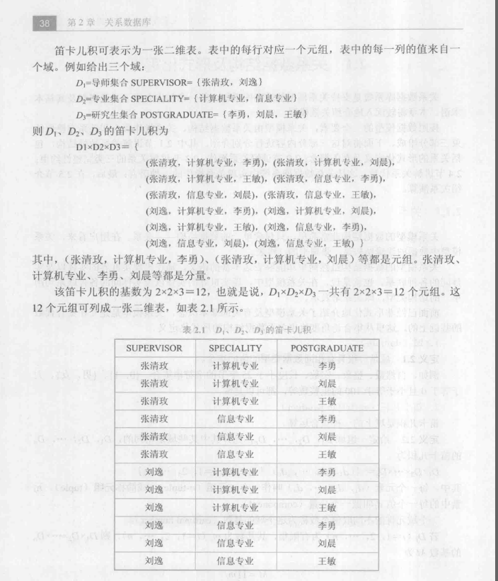

# 02-1 上课计划  
---
## 1 回顾上周  
---
```01-20200221
## 01-20200221
1. 数据库4个基本概念(Data，DB，DBMS，DBS)   (重点)  
2. 数据管理技术的产生和发展(三个阶段)    
3. 数据库系统的特点(4个特点)                (重点)    
4. 数据模型：组成三要素、 两大类：概念模型(又叫信息模型)，逻辑和物理模型     
5. 常见的数据模型                         (重点：关系模型及相关术语)       
6. 数据库三级模式结构和二级映像            (重点、难点)
7. 数据库系统的组成     
```

## 2 学生问题   
1. SQL SERVER 2008安装，尽量在自己电脑安装，实在不行就装虚拟机   
	- 因为虚拟机可能有些同学的电脑卡顿  
2. 关系术语概念中，一个主码可以唯一标识一个关系吗，还是多个主码才标识一个关系？   
	- 关系是通常说的二维表，元组是表中一行(或一个记录)   
	- 主码能惟一地标识一个元组   
	- 一个主码可能有多个属性(即一个属性组)   
3. 主码和候选码是一个属性还是属性组？  
	- 都有可能：学号都不同的话，学号为主码是一个属性；   
4. 在一个关系中，主码和候选码是否是确定的，还是说它们仅仅是一个状态量？  
	- 候选码是根据关系可以确定的   
	- 若一个关系中有多个候选码，主码是其中的一个   
5. 三类关系：基本关系、查询表、视图表，有具体的表示方式吗   
	- 都可以用二维表来表示    

## 3 本节课内容    
### 3.1 关系  
1. 域：域是一组具有相同数据类型的值的集合   
2. 笛卡儿积 ：一种集合运算，找到对应属性所有元组的集合   
	- 有些元组不一定有意义   
	- 一个域允许的不同取值的个数称为这个域的基数   
	- 笛卡儿积元组数为各个域基数的乘积   
	- 笛卡儿积可表示为一个二维表  
    
3. 关系：$ D_1  \times D_2 \times ...\times D_n $的子集叫做在域$ D_1 ，D_2 ，..., D_n $上的**关系**，表示为$$ R( D_1 ，D_2 ，..., D_n)$$，这里的R表示关系的名字，n表示关系的**目**或**度**       
	- $ D_i$是给定的一组域   
	- n目关系必有n个属性    
	- 关系是笛卡儿积的有限子集(提取有意义的元组构造关系)   
	- 关系术语   
		- 关系、元组、属性   
		- 选课表(数据量大一些)：知道学生和课程，就能找到成绩   
		- 若关系中的某一属性组能惟一地标识一个元组，而其**子集不能**，则称该元组为候选码   
		- **候选码的诸属性称为主属性**    
	- 三类关系：基本关系、查询表、视图   
	- 基本关系6性质：同质(同一个域)   
4. 关系模式：关系的描述称为关系模式，它可以形式化的表示为$$R(U, D , DOM, F)$$ 其中R为关系名，U为组成该关系的属性名集合，D为U中属性所来自的域，DOM为属性向域的映像集合，F为属性间数据的依赖关系集合   
	- DOM：每个属性取自哪个域   
	- F：数据间的依赖：数据依赖、函数依赖、多值依赖    
5. 关系数据库 在给定的应用领域，所有**关系的集合**构成一个关系数据库     
	- 型：关系数据库模式包括若干域的定义，以及在域上定义的若干关系模式   
	- 值：在某一时刻对应的关系的集合   
### 3.2 关系操作  
1. 基本关系操作：关系模型中常用的关系操作包括：**查询操作**和**插入、删除修改操作**两大部分   
	- 查询是关系操作中最主要的部分，还可以分为：选择、投影、连接、除、并、差、交、笛卡儿积等   
	- 一次一集合的方式   
2. 关系语言的分类  
	- 介于关系代数和关系演算之间的结构化查询语言（SQL）  
	- 不仅具有查询功能还可以进行数据定义和数据控制功能  
	- 集数据查询、控制、定义、操作于一体的关系数据语言  
### 3.3 关系完整性  
1. 实体完整性：若属性（指一个或一组属性）A是基本关系R的主属性，则A不能取空值。  
	- 每个元组应该是可区分的，是惟一的  
	- 一个表对应现实世界的实体集，现实世界实体可区分，因此表中元组也应该是可区分，主码就作为区分的一个指标，因此他也不可为空  
2. 参照完整性：  
	- 关系间的引用：引用不同的关系、引用自己  
	- 设F是基本关系R的一个或一组属性，但不是关系R的码，Ks是基本关系S的主码。如果F与Ks相对应，则称F是基本关系R的**外码  **   
		- R为参照关系，S为被参照关系  
		- R中属性F参照了S的主码   
	- 若属性（或属性组）F是基本关系R的外码，它与基本关系S的主码$K_s$相对应（基本关系R和S不一定是不同的关系），则对于R的每个元组在F上的**取值**必须：  
		- 或者取空值（F的每个属性值均为空值）   
		- 或者等于S中某个元组的主码值    
3. 用户定义完整性  
	- 针对某一具体关系数据库的约束条件，反映某一具体应用所涉及的数据必须满足的语义要求   
	- 关系模型应提供定义和检验这类完整性的机制   
	- **针对某一具体数据库的条件**     
## 4 课下要求  
1. 结合PPT看课本  
2. 雪梨课程视频  
3. **雪梨任务认真做，别忘了提交 **  
4. 遇到问题及时向学委反馈，我会根据课表时间答疑    
5. 下节课提问没看直播的学生  
6. **周五下午直播答疑**   


