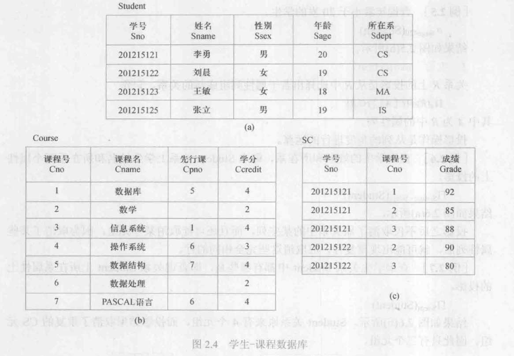

# 03-1 上课计划  
---
## 1 回顾上周  
---
```02-2
## 02-2  
1. 传统的集合运算(并、差、交、笛卡儿积)   
2. 专门关系运算的记号          
3. 选择、投影 
4. 连接($\theta$ 等值连接，自然连接，(左、右)外连接)
5. 除(象集的求法、除运算的场景)    
```

## 2 学生问题   
1. 没看直播的学生联系我，说明原因   
2. 一个关系中，有学号和姓名等属性，学号和姓名都不相同，我选姓名可以做主码吗？  
	- 用学号做主码(防止插入有重名)   
3. 课后习题第六题后三个式子具体的推理过程不太懂   
4. 课本上2.4的例2.12与例2.13和课后题6的（3）（4）（5）   
	- 一会儿专门讲一下   

## 3 本节课内容    
### 3.1 例题  
   
   

- 解法1：除法  
	- 对于**至少选修1号课程和3号课程**：指的是课程号既包含1，又包含3，那么我们就把课程号有1和有3的属性作为除数，且作为除数的$Y$属性    
	- **最后求的是学生学号**：学生学号即作为被除数的$X$属性  
	- R被除数**仅包含**属性学号和课程号$X，Y$   
	- 除数包含属性课程号且里面只有取值1和3作为$Y$，其他属性可有可无，因为其他属性会成为$Z$对结果不会有影响   
	- $R = \Pi_{Sno,Cno}(SC) \quad S = \sigma_{Cno='1' \vee Cno='3'}(SC)   \quad T = R \div S$  
	- $\because K =\Pi_{Cno}(\sigma_{Cno='1' \vee Cno='3'}(SC)) \quad \therefore T = R \div K $  
- 解法2：求交集    
	- 对于**至少选修1号课程和3号课程学生学号**：指的是课程号既包含1，又包含3，那么我们考虑：先找到选修1号课程的学生学号，再找到选修3号课程的学生学号，最后**两个结果求交集**即可   
	- 选修1号课程的学生学号：$\Pi_{Sno}( \sigma_{Cno = '1'}(SC))$   
	- 选修3号课程的学生学号：$\Pi_{Sno}( \sigma_{Cno = '3'}(SC))$    
	- 集合求交集$ (\Pi_{Sno}( \sigma_{Cno = '1'}(SC))) \cap (\Pi_{Sno}( \sigma_{Cno = '3'}(SC)))   $   

   

- 先选出‘2‘号课程，再将结果投影只显示学号即可      


   
:pencil:因为这个题目中先行课的号码只有一个，即除数属性值只有一个值5号，因此，用不用除法去求均可得到答案   

- **不用除法做法：**   
  - 要找选修5号先行课程的学生姓名，我们只能在Course表中，找到选修5号课程的课程号，然后根据课程号再去SC表找选该课程的学号，最后根据学号在Student表，找这些学生姓名   
  - 选修5号课程的课程号：$\Pi_{Cno}(\sigma_{Cpno = '5'}(Course))$    
  - 课程号再去SC表找选该课程的学号:$ \Pi_{Sno}  (\Pi_{Cno}(\sigma_{Cpno = '5'}(Course)) \bowtie SC) $   
  - 根据学号在Student表找这些学生姓名:$\Pi_{Sname} ( \Pi_{Sno}  (\Pi_{Cno}(\sigma_{Cpno = '5'}(Course)) \bowtie SC) \bowtie Student)$    

- **不用除法的书中答案：**   
  - $\Pi_{Sname}(\sigma_{Cpno='5'}(Course) \bowtie SC\bowtie\Pi_{Sno,Sname}(Student_\ ))$   
  - $\Pi_{Sname}(\Pi_{Sno}(\sigma_{Cpno='5'}(Course)\bowtie SC) \bowtie \Pi_{Sno,Sname}(Student))$  
- :pencil:因为这个题目中由于情况比较特殊，找的只是一种情况，不用除法去求解更好   
- :pencil:对于书中给的答案更好一些，因为先自然连接后选择的话，对效率会产生影响    


   

- 查询**选修了全部课程**的学生学号和姓名，根据SC表我们可以找到每位学生选了哪些课程，我们要找的每个学号对应的象集，是否包含Course课程中的所有学号，最简单思路是除法，属性组X是学号，属性组Y是课程号$\Pi_{Sno,Cno}(SC) \div Course \bowtie \Pi_{Sno,Sname}(Student)$  
- 还可以用集合求交集：根据Course表可以知道课程号有哪些，然后，根据SC表可以找到选修每门课程的学生有哪些，每门课程都找到对应选修的学生，求交集即可$\Pi_{Sno} (\sigma_{Cno = '1'}(SC)) \cap \Pi_{Sno} (\sigma_{Cno = '2'}(SC)) \cap  ... \Pi_{Sno} (\sigma_{Cno = '7'}(SC))     \bowtie \Pi_{Sno,Sname}(Student) $   


- **其他解法**
	- **略**  


### 3.2 习题  
   
   
   

- S表、P表和J表通过SPJ表发生关系，且SPJ表中三个主属性都是外码   

1. 求供应工程J1零件的供应商号码SNO   
  - J1属于JNO属性，求它对应的SNO有哪些？  
  - 分析SPJ表即可，里面既有JNO又有SNO   
  - 先选择JNO = J1，再投影到SNO即可  
  - $\Pi_{SNO}(\sigma_{JNO = 'J1'}(SPJ))$   
2. 求供应工程J1零件P1的供应商号码SNO   
  - J1属于JNO属性，P1属于PNO属性，求SNO有哪些？  
  - 分析SPJ表即可，里面既有JNO又有PNO，还有SNO  
  - 先选择JNO = J1，PNO = P1，再投影到SNO即可  
  - $\Pi_{SNO}(\sigma_{JNO = 'J1' \wedge PNO = 'P1'}(SPJ))$   
3. 求供应工程J1零件为红色的供应商号码SNO   
  - J1属于JNO属性，红色属于COLOR属性，求SNO有哪些？  
  - JNO属性属于J表或者SPJ表，COLOR属性属于P表，SNO属性属于S表和SPJ表，但是SPJ表和P表可以连接可以将JNO属性和COLOR属性以及SNO属性合成一个表操作，但是在连接之前最好简化表格  
  - 先在SPJ表中找JNO = J1的PNO有哪些，方便下一步连接$\Pi_{PNO,SNO}(\sigma_{JNO = 'J1'}(SPJ ))$  
  - 将选择的结果与COLOR属性为红色的P表进行连接，$\Pi_{PNO,SNO}(\sigma_{JNO = 'J1'}(SPJ )) \bowtie \sigma_{COLOR = '红'}(P)$   
  - 对连接的结果投影到SNO即可$\Pi_{SNO}(\Pi_{PNO,SNO}(\sigma_{JNO = 'J1'}(SPJ )) \bowtie \sigma_{COLOR = '红'}(P))$  
4. 求没有使用天津供应商生产的红色零件的工程号JNO   
  - 找它的反面，再用减法即可：先找使用天津供应商生产的红色零件的工程号JNO   
  - 在供应商表S中，找到CITY=’天津‘的SNO，再和SPJ连接找P表中COLOR=’红色‘，在投影到JNO  
  - 先在表S中找到CITY=’天津‘的SNO：$\Pi_{SNO}(\sigma_{CITY=’天津‘}(S))$  
  - 与SPJ连接，找到对应的PNO(用于和P表连接)和JNO(求解属性)$\Pi_{SNO}(\sigma_{CITY=’天津‘}(S)) \bowtie SPJ $   
  - 与COLOR是红色的P表连接，投影到JNO即可：$\Pi_{JNO}( \Pi_{SNO}(\sigma_{CITY=’天津‘}(S)) \bowtie SPJ \bowtie (\sigma_{COLOR= '红'}(P)))$   
  - 最后，因为我们求的是反面，还要用所有JNO的取值减去结果$\Pi_{JNO}(J) - \Pi_{JNO}( \Pi_{SNO}(\sigma_{CITY=’天津‘}(S)) \bowtie SPJ \bowtie (\sigma_{COLOR= '红'}(P)))$    
5. 求至少用了供应商S1所供应的全部零件的工程号JNO   
  - S1的全部零件可以从零件表P得到，最后求的是工程号JNO，这个可以知道是用除法求解，根据除运算公式$R(X,Y)\div S(Y,Z)=T(X)$，JNO结果即为X属性，SPJ中S1的全部零件即为除数，包含JNO和PNO的即为表SPJ，那么从里面选出被除数   

  - 被除数：$\Pi_{PNO,JNO}(SPJ)$   

  - 除数：$\Pi_{PNO}(\sigma_{SNO='S1'}(SPJ))$   

  - 所以：$ \Pi_{PNO,JNO}(SPJ) \div \Pi_{PNO}(\sigma_{SNO='S1'}(SPJ))$      

:pencil:$\sigma$下标有多个条件时，用$\vee、\wedge或\lnot$    

:pencil:$\Pi$下标有多个属性时，用逗号   

### 3.3 SQLServer的介绍      
- 如何打开SQLServer    
- 界面的介绍  
- SQL语句怎么写  


## 4 课下要求  
1. **雪梨任务认真做，别忘了提交 **  
2. 遇到问题及时向学委反馈，我会根据课表时间答疑    
3. SQLServer必须安装成功    
4. **周五上午和下午都有直播，大家必须在**   


