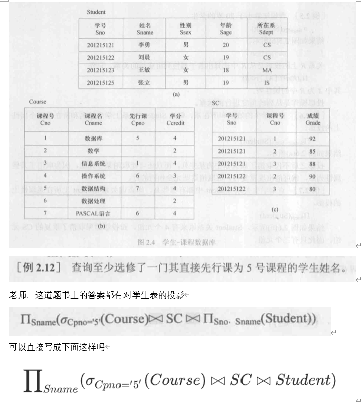

# 03-2 上课计划  
---
## 1 回顾上周  
---
```03-1
## 03-1
1. 讲了书上的例题  
2. 课后习题6
3. SQLServer的打开与简介
```

## 2 学生问题   
1. 刘金帅的问题  
   

- - 对于一些关系运算结果可能不唯一   


## 3 本节课内容    
- 结构化查询语言(SQL)是关系数据库的标准语言，也是一个通用的、功能极强的关系数据库语言    
### 3.1 SQL概述  
- 大多数数据库均用SQL作为共同的数据存取语言和标准接口，使不同数据库之间的互操作有了共同的基础    
#### 3.1.1 SQL的产生和发展  
- SQL是在1974年由Boyce和Chamberlin提出，最初叫Sequel，并在IBM公司研制的关系数据库管理系统原型System R上实现。  
- 1987年，国际化组织通过了SQL这一标准，从标准公布以来岁数据库的发展也在不断的发展和丰富  

#### 3.1.2 SQL的特点  
- SQL是一个综合的、功能极强同时又简洁易学的语言。集数据查询、数据操纵、数据定义和数据控制功能于一体包括以下特点：
	1. 综合统一 
	2. 高度非过程化  
	3. 面向集合的操作方式  
	4. 以同一种语法结构提供多种使用方式   
	5. 语言简单，易学易用  

SQL功能|动词
-|- 
数据查询|SELECT
数据定义|CREATE,DROP,ALTER
数据操纵|INSERT,UPDATE,DELETE
数据控制|GRANT,REVOKE

#### 3.1.3 SQL的基本概念  
- 支持SQL的关系数据库管理系统三级模式结构  
	- 外模式：若干视图和部分基本表  
	- 模式：若干基本表  
	- 内模式：若干存储文件 
- SQL对基本表和视图进行查询或其他操作，基本表和视图一样，都是关系   
- 基本表是本身独立存在的表，一个或多个基本表对应一个存储文件  
- 视图是从一个或几个基本表导出表。它本身不独立存储在数据库中，即数据库中只存放视图的定义而没有对应的数据  
	- 视图的数据仍存放导出视图的基本表中，因此视图是一个虚表  
### 3.2 学生-课程数据库  
- 以学生-课程数据库为例来讲解SQL的数据定义、数据操纵、数据查询和数据控制语句。  
	- 学生表：Student(<u>Sno</u>,Sname,Ssex,Sage,Sdept)   
	- 课程表：Course(<u>Cno</u>,Cname,Cpno,Ccredit)   
	- 学生选课表：SC(<u>Sno,Cno</u>,Grade)  

### 3.3 数据定义  
- 关系数据库系统支持三级模式结构、其模式、外模式和内模式中的基本对象有模式、表、视图和索引等，因此SQL的数据定义功能包括：模式定义、表定义、视图和索引的定义   

操作对象|创建|删除|修改
-|-|-|-
模式|CREATE SCHEMA|DROP SCHEMA| 
表|CREATE TABLE|DROP TABLE|ALTER TABLE
视图|CREATE VIEW|DROP VIEW
索引|CREATE INDEX|DROP INDEX|ALTER INDEX
数据库|CREATE DATABASE|DROP DATABASE|  

- SQL不提供修改模式定义和修改视图定义操作。用户想修改这些对象，只能先删除再重建  
- 目前，一个关系数据库管理系统的实例中可以建立多个数据库，一个数据库可以建立多个模式，一个模式下通常包括多个表、视图和索引等数据库对象 

#### 3.3.1 SQLServer常用快捷键     
- Ctrl + N：新建查询"窗口。  
- F5：运行调试    
- CTRL+SHIFT+L： 使选定内容为小写。   
- CTRL+SHIFT+U：使选定内容为大写。   

#### 3.3.2 数据库的创建与删除   
```SQL  
create database ywb;
use ywb;   -- 不需要加database
drop database ywb;
```

- 不能删除当前数据库   
- 创建和删除数据库需要刷新才能看到效果  
#### 3.3.3 模式的定义与删除
1. 定义模式   
```SQL 
use ywb;
create schema ty authorization guest; 
-- 创建的模式在：当前数据库 → 安全性 → 架构(schema)
-- SQLServer 删除模式时，不支持级联  
```

- dbo是每个数据库的默认用户，具有所有者权限，即DbOwner， dbo也是一个模式   
- dbo一个是用户dbo，相当linux中的root用户，拥有最高权限，用windows身份验证登录进去，映射到具体数据库中就是dbo用户；二是模式dbo，默认属于用户dbo，是用户dbo的一个默认命名空间。   


#### 3.3.2 基本表的定义、删除与修改   
1. 数据类型  
	 - char和varchar最大的区别就在于char不管实际value都会占用n个字符的空间，而varchar只会占用实际字符应该占用的空间+1，并且实际空间+1<=n。  
	 - 
2. 定义基本表  
```SQL
create table Student
(Sno char(9) primary key,  -- 以逗号结尾且用的小括号
 Sname varchar(20) unique,
 Ssex char(2),
 Sage smallint,
 Sdept char(20)
);

create table "ty".Student
(Sno char(9) primary key,  -- 以逗号结尾
 Sname varchar(20) unique,
 Ssex char(2),
 Sage smallint,
 Sdept char(20)
);
drop table Student;  
drop table "ty".Student;  
```
```SQL
create table course
(Cno char(4) primary key,
 Cname char(40) not null,
 Cpno char(4),
 Ccredit smallint,
 foreign key(Cpno) references Course(Cno)
);
create table SC
(Sno char(9),
 Cno char(4),
 Grade smallint,
 -- 因为主码有两个属性，所以我们只能作为表级完整性定义 
 primary key(Sno, Cno),
 foreign key (Sno) references Student(Sno),
 foreign key (Cno) references Course(Cno)
);
```

- 黄色小钥匙代表主码的属性  
- 灰色小钥匙代表外码的属性  
- 根据实体完整性，主属性非空  
- PRIMARY  KEY与 UNIQUE的区别：  
	- 主键列不允许空值，而唯一性约束列允许空值。   
	- 主键只允许一个，唯一性约束列允许多个  
	- 当没有设定主键时，非空唯一索引自动称为主键。  


4. 修改基本表  
	- SQL语言用`alter table`语句修改基本表，一般格式：   
```SQL
alter table Student add Entrance date;
alter table Student add unique(Entrance); 
alter table Student alter column Entrance varchar(20) ;
```

5. 删除基本表  
```SQL
drop table Student cascade; -- 关键字 'cascade' 附近有语法错误。
drop table Student;  -- 有外码引用不能删除
drop table SC;
drop table Student;
```

#### 3.3.3 索引的建立与删除   
- 建立索引是加快查询速度的有效手段。
```SQL
-- 1. 建立索引 
	create unique index Courno on Course(Cno);
-- 2. 删除索引 
	drop index Course.Courno; 
```

- UNIQUE表明此索引的每一个索引值只对应唯一的数据记录  
- CLUSTER表示要建立的索引是聚簇索引（第7章介绍）  


## 4 课下要求  
1. 结合PPT看课本  
2. **雪梨任务认真做，别忘了提交 **  
3. 下次作业，交实验手册     
4. 遇到问题及时向学委反馈，我会根据课表时间答疑    
5. **周三见**    


