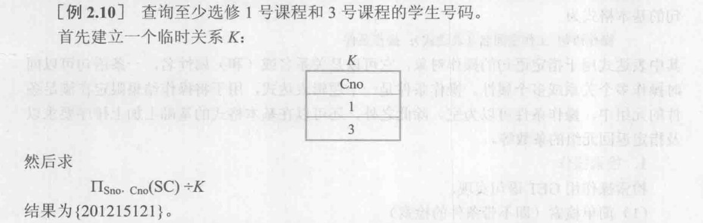
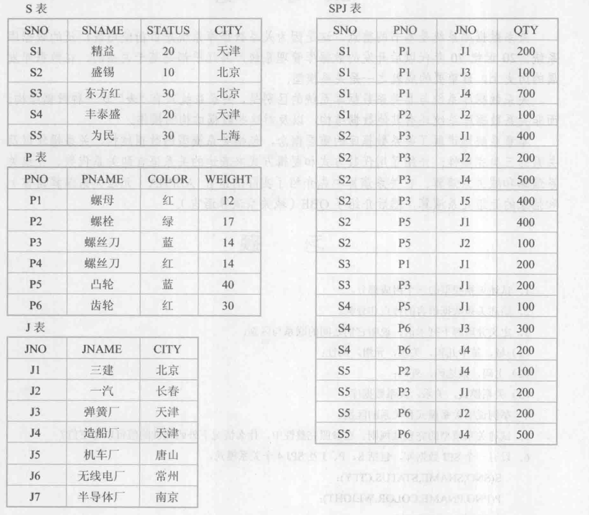

## 第2章 关系数据库     
[TOC]

关系代数运算符表   

集合运算符|含义|专门关系运算符|含义|逻辑运算符|含义 |集合运算符|含义
:-:|:-:|:-:|:-:|:-:|:-:|:-:|:-:  
$\cup$|并|$\sigma$|选择|$\vee$|或|$\in$|属于
$-$|差|$\Pi$|投影|$\wedge$|与|$\notin$|不属于
$\cap$|交|$\bowtie$|连接|$\lnot$|非|$\subseteq$|包含
$\times$|笛卡儿积|$\div$|除|||$\not\subseteq$|不包含

### 2.4 关系代数  
- 关系代数是一种抽象的查询语言，它用对关系的运算来表达查询  
- 运算的三大要素   
	- 对象  
	- 运算符  
	- 运算结果  
- 关系代数的运算按运算符的不同分为   
	- 传统的集合运算：元组集合，从行的角度考虑  
	- 专门的关系运算：不仅涉及行，而且涉及列  
#### 2.4.1 传统的集合运算  
- 传统的集合运算是二目运算，包括并、差、交、笛卡儿积4中运算	   
- 设关系R和关系S具有相同的目n（即两个关系都有n个属性），且相应的属性取自同一个域，t是元组变量，$t \in R$表示t是R的一个元组   
	- 并：$R \cup S = \lbrace t|t \in R \vee  t \in S \rbrace$  
	- 差：$R - S =  \lbrace t|t \in R \wedge  t \notin S \rbrace$   
	- 交：$ R \cap S = \lbrace  t|t \in R \wedge t \in S  \rbrace $  
	- 笛卡儿积：严格的说是广义笛卡儿积，这里笛卡儿积的元素是元组$$R \times S = \lbrace  \overset{\frown}{t_r t_s} | t_r \in R  \wedge  t_s \in S \rbrace$$    
		- 两个分别为n目和m目关系R和S的笛卡儿积是一个$(n + m)$列的元组集合。     
		- 元组的前n列是关系R的一个元组，后m列是关系S的一个元组。   
		- 若R有$k_1$个元组，S有$k_2$个元组，则关系R和关系S的笛卡儿积有$k_1 \times k_2$个元组   
#### 2.4.2 专门的关系运算   
- 专门的关系运算包括选择、投影、连接、除运算等  
	- 设关系模式为$ R(A_1, A_2,...,A_n)$，它的一个关系设为R。$t \in R$表示t是R的一个元组。$ t[A_i]$则表示元组t中相应于属性$A_i$的一个分量   
	- 若$A= \lbrace A_{i1}, A_{i2},...,A_{ik} \rbrace$，其中$ A_{i1}, A_{i2},...,A_{ik} $是$A_1,A_2,...,A_n $中的一部分，则A称为属性列或属性组。$t[A] = (t[A_{i1}], t[A_{i2}],...,t[A_{ik}])$表示元组t在属性列A上诸分量的集合，$\overline{A}$则表示${A_1,A_2,...,A_n}$中去掉 $\lbrace   A_{i1}, A_{i2},...,A_{ik} \rbrace$后剩余的属性组。    
	- R为n目关系，S为m目关系。$t_r \in R，t_s \in S​$，$\overset{\frown}{t_r t_s}​$称为元组连接或元组的串接。它是一个$n+m​$列的元组，前n个分量为R中的一个n元组，后m个分量为S中的一个m元组。   
	- 给定一个关系$R(X,Z)$，X和Z是属性组。当$t[X]= x$时，x是R的一个象集定义为$$Z_x = \lbrace t[Z]|t \in R, t[X] =x  \rbrace$$它表示R中属性组X上的值为x的诸元素在Z上分量的集合  
1. 选择  
- 选择又称为限制。它是关系R中选择满足给定条件的诸元组，记作$$ \sigma_F(R) = \lbrace t|t \in R  \wedge F(t ) = '真' \rbrace $$ 其中F表示选择条件，它是一个逻辑表达式，取逻辑值“真”或“假”   
	- 逻辑表达式F的基本形式：$X_1 \theta Y_1$，其中$ \theta $表示比较符，可以取值：$\lbrace \lt \  \gt \ \le \ \ge \ \neq   \rbrace$。$X_1，Y_1$等是属性名，或为常数，或为简单函数；属性名也可以用它的序号来代替。    
	- 在基本的选择条件上可以进一步进行逻辑运算，即求$非(\lnot)，与 (\wedge)，或(\vee )$运算。  
	- 选择是从关系R中选取使逻辑表达式F为真的元组。**这是从行的角度进行运算**  
	- 例如：$\sigma_{Sdept = 'IS'}(Student_\ )$    

---

2. 投影  
- 关系R上的投影是从R中选择出若干属性列组成**新的关系**。记作$$\Pi_A(R) = \lbrace t[A]|t \in R \rbrace$$其中A为R中的属性列  
	- **投影操作是从列的角度进行的运算**    
	- **但是会去除重复行(因为关系不允许重复元组)**      
	- 例如： $\Pi_{Sname, Sdept}(Student)$     

---

3. 连接  
- 连接也称为$\theta$连接。它是从两个关系的笛卡儿积中选取属性间满足一定条件的元组     

- 记作：$ \mathop{R  \bowtie S} \limits_{A \theta B} = \lbrace \overset{\frown}{t_r t_s} | t_r \in R  \wedge  t_s \in S \wedge t_r[A] \theta t_s[B] \rbrace$     
- :pencil:从R中拿一个$t_r$和S中拿一个$t_s$，且保留满足$t_r$中的A属性和$t_s$中的B属性，满足$A \theta B$关系的元组    
- A和B分别为R和S上列数相等的且可比的属性组，$\theta$是比较运算符。    
- 连接运算从R和S的笛卡儿积$ R \times S$中选取R关系在A属性组上的值与S关系在B属性组上的值满足比较关系$ \theta$的元组    
- 连接运算有两种最重要也是最常用的连接   
  - 等值连接：当$ \theta$为”=“时      
  - 自然连接：一种特殊的等值连接    
    - a) 两个关系中进行比较的分量必须是同名的属性组，并且在结果中把重复的属性列去掉   
    - b) 即若R和S中具有相同的属性组B，U为R和S的全体属性集合，则自然连接记作$$R  \bowtie S = \lbrace \overset{\frown}{t_r t_s}[U-B]|t_r \in R  \wedge  t_s \in S \wedge t_r[B] = t_s[B]  \rbrace$$     
    - :pencil:因为自然连接需要去掉重复属性组，因此比较的分量必须属性名相同   
- 一般的连接操作是从行的角度进行运算，但自然连接还需要**取消重复列(重复列保留一个属性组)**，所以**是同时从行和列的角度进行运算**    

   

- 两个关系R和S在做自然连接时，**选择两个关系在公共属性上值相等的元组**，构成新的关系   
- 关系R中某些元组有可能在S中不存在公共属性上相等的元组，从而造成R中这些元组被舍弃，或者S中某些元组被舍弃，**这些被舍弃的元组称为悬浮元组**    
- :pencil:外连接、左外连接和右外连接都是建立在自然连接的基础上，想把悬浮数组加进来  
	- a. 如果把悬浮元组也保存在结果关系中，而在其他属性上填空值(NULL)，那么这种连接叫做**外连接**     
	- :pencil: **外连接**增加元组个数为，R和S悬浮元组之和   
	- b. 如果只保留左边关系R中的悬浮元组就叫做**左外连接**   
	- :pencil: **左外连接**增加元组个数为，R悬浮元组个数     
	- c. 如果只保留右边关系R中的悬浮元组就叫做**右外连接**  
	- :pencil: **右外连接**增加元组个数为，S悬浮元组个数       

  

---

4. 除运算  
- 关系R除以关系S的结果为关系T，则**T包含所有在R但不在S中的属性及其值，且T的元组与S的元组的所有组合都在R中。**   
- 下面用**象集**来定义除法：  
  - 给定关系$R(X,Y)$和$S(Y,Z)$，其中$X，Y，Z$为属性组。R中的Y与S中的Y可以有不同的属性名，但必须出自相同的域集。   
  - R与S的除运算得到一个新的关系$P(X)$，P是R中满足下列条件的元组在X属性列上的投影：元组在X上分量值x的象集$Y_x$包含S在Y上投影的集合。记作$$R \div S = \lbrace t_r[X]|t_r \in R \wedge \Pi_Y(S) \subseteq Y_x \rbrace$$ 其中$Y_x$为$x$在$R$中的象集，$x = t_r[X]$ 。   
  - 除操作同时从行和列角度进行运算。   
- 例2.9 设关系R、S分别如下图，$R \div S$的结果求法。
  - i. 在关系R中，A可以取4个值$\lbrace a_1,a_2,a_3,a_4 \rbrace$。其中：
  	- $a_1$的象集为$\lbrace (b_1,c_2),(b_2,c_3),(b_2,c_1) \rbrace$   
  	- $a_2$的象集为$\lbrace (b_3,c_7),(b_2,c_3)\rbrace$   
  	- $a_3$的象集为$\lbrace (b_4,c_6) \rbrace$   
  	- $a_4$的象集为$\lbrace (b_6,c_6)\rbrace$   
  - ii. $S$在$(B,C)$上的投影为$\lbrace (b_1,c_2)， (b_2,c_1)， (b_2,c_3)\rbrace$  
  - iii. 只有$a_1$的象集$(B,C_\ )_{a_1}$ 包含了$S$在$(B,C)$属性组上的投影   
  - iv. $R \div S = \lbrace a_1 \rbrace$    

  

- :pencil:根据除运算的定义，**除的结果T包含所有在$R(X,Y)$但不在$S(Y,Z)$中的属性及其值**：决定了结果T中的属性是$X$   
- :pencil:**T的元组与S中的元组的所有组合都在R中**：决定了$\Pi_{X,Y}(T \times S)  \subseteq  R$    
- :pencil:**用于解决**：R(X，Y)中一个属性X$Y$属性取值，包含S中所有$Y$属性取值的，$X$属性值有哪些？ 
- :pencil:$Z$属性可有可无对结果不会产生影响     
- :pencil:快速算法：   
  - i. 先确定R和S中的属性组$X,Y,Z$   
  - ii. 因为结果T中只包含属性$X$，因此确定T中属性   
  - iii. 在R中找属性$X$所有取值，根据取值的对应的$Y$是否**都在**S中属性$Y$出现：  
    - a)若都出现在S的$Y$中，那么将该$X$属性值填入T中     
    - b)若有一个未出现在S的$Y$中，那么该$X$属性值舍弃    

### 2.5 例题   

   
   

- 解法1：除法  
	- 对于**至少选修1号课程和3号课程**：指的是课程号既包含1，又包含3，那么我们就把课程号有1和有3的属性作为除数，且作为除数的$Y$属性    
	- **最后求的是学生学号**：学生学号即作为被除数的$X$属性  
	- R被除数**仅包含**属性学号和课程号$X，Y$   
	- 除数包含属性课程号且里面只有取值1和3作为$Y$，其他属性可有可无，因为其他属性会成为$Z$对结果不会有影响   
	- $R = \Pi_{Sno,Cno}(SC) \quad S = \sigma_{Cno='1' \vee Cno='3'}(SC)   \quad T = R \div S$  
	- $\because K =\Pi_{Cno}(\sigma_{Cno='1' \vee Cno='3'}(SC)) \quad \therefore T = R \div K $  
- 解法2：求交集    
	- 对于**至少选修1号课程和3号课程学生学号**：指的是课程号既包含1，又包含3，那么我们考虑：先找到选修1号课程的学生学号，再找到选修3号课程的学生学号，最后**两个结果求交集**即可   
	- 选修1号课程的学生学号：$\Pi_{Sno}( \sigma_{Cno = '1'}(SC))$   
	- 选修3号课程的学生学号：$\Pi_{Sno}( \sigma_{Cno = '3'}(SC))$    
	- 集合求交集$ (\Pi_{Sno}( \sigma_{Cno = '1'}(SC))) \cap (\Pi_{Sno}( \sigma_{Cno = '3'}(SC)))   $   

   

- 先选出‘2‘号课程，再将结果投影只显示学号即可      

   
:pencil:因为这个题目中先行课的号码只有一个，即除数属性值只有一个值5号，因此，用不用除法去求均可得到答案   

- **用除法做法：**:   
	- **至少选修了一门直接先行课为5号课程**：指先行课包含5，那么我们把先行课为5号的属性作为除数，且作为除数的Y属性：$S = \Pi_{Cpno}(\sigma_{Cpno = '5'}(Course))$   
	- **最后求的是学生姓名**：那么学生姓名作为被除数的属性$X$     
	- **那么被除数一定要仅包含$X$和$Y$属性**，即R中仅有姓名和先行课:$R = \Pi_{Sname,Cpno}(Course \bowtie SC \bowtie Student)$   
	- $\therefore T = R \div S $   
- **不用除法做法：**   
	- 要找选修5号先行课程的学生姓名，我们只能在Course表中，找到选修5号课程的课程号，然后根据课程号再去SC表找选该课程的学号，最后根据学号在Student表，找这些学生姓名   
	- 选修5号课程的课程号：$\Pi_{Cno}(\sigma_{Cpno = '5'}(Course))$    
	- 课程号再去SC表找选该课程的学号:$ \Pi_{Sno}  (\Pi_{Cno}(\sigma_{Cpno = '5'}(Course)) \bowtie SC) $   
	- 根据学号在Student表找这些学生姓名:$\Pi_{Sname} ( \Pi_{Sno}  (\Pi_{Cno}(\sigma_{Cpno = '5'}(Course)) \bowtie SC) \bowtie Student)$    

- **不用除法的书中答案：**   
	- $\Pi_{Sname}(\sigma_{Cpno='5'}(Course) \bowtie SC\bowtie\Pi_{Sno,Sname}(Student_\ ))$   
	- $\Pi_{Sname}(\Pi_{Sno}(\sigma_{Cpno='5'}(Course)\bowtie \Pi_{Sno,Sname}(Student))$  
- :pencil:因为这个题目中由于情况比较特殊，找的只是一种情况，不用除法去求解更好   
- :pencil:对于书中给的答案更好一些，因为先自然连接后选择的话，对效率会产生影响    

   

- 查询**选修了全部课程**的学生学号和姓名，根据SC表我们可以找到每位学生选了哪些课程，我们要找的每个学号对应的象集，是否包含Course课程中的所有学号，最简单思路是除法，属性组X是学号，属性组Y是课程号$\Pi_{Sno,Cno}(SC) \div Course \bowtie \Pi_{Sno,Sname}(Student)$  
- 还可以用集合求交集：根据Course表可以知道课程号有哪些，然后，根据SC表可以找到选修每门课程的学生有哪些，每门课程都找到对应选修的学生，求交集即可$\Pi_{Sno} (\sigma_{Cno = '1'}(SC)) \cap \Pi_{Sno} (\sigma_{Cno = '2'}(SC)) \cap  ... \Pi_{Sno} (\sigma_{Cno = '7'}(SC))     \bowtie \Pi_{Sno,Sname}(Student) $   

- **其他解法**
	- **先连接后除法：**  
		- **选修了全部课程**：那么全部课程就是属性$Y$    
		- **求的结果是**：学号和姓名，那么就是属性$X$  
		- 被除数仅包含：属性$X，Y$那么 $R= \Pi_{Sno, Sname, Cno}(Course \bowtie SC \bowtie Student)$    
		- 除数：只要有全部课程即可，那么$S = Course$   
		- $ T = R \div S$  
	- **先除法后连接：**  
		- **选修了全部课程**：那么全部课程就是属性$Y$   
		- **求的结果是**：学号和姓名，那么我们可以先找到学号，再和Student做自然连接，找到姓名，因此学号作为属性$X$   
		- 被除数仅包含：属性$X，Y$那么$R= \Pi_{Sno,  Cno}(Course \bowtie SC )$    
		- 除数：只要有全部课程即可，那么$S = Course$   
		-  $ T =\Pi_{Sno, Sname} (R \div S \bowtie Student)$  

### 2.6 习题  
   
   
   

- S表、P表和J表通过SPJ表发生关系，且SPJ表中三个主属性都是外码   

1. 求供应工程J1零件的供应商号码SNO   
  - J1属于JNO属性，求它对应的SNO有哪些？  
  - 分析SPJ表即可，里面既有JNO又有SNO   
  - 先选择JNO = J1，再投影到SNO即可  
  - $\Pi_{SNO}(\sigma_{JNO = 'J1'}(SPJ))$   
2. 求供应工程J1零件P1的供应商号码SNO   
  - J1属于JNO属性，P1属于PNO属性，求SNO有哪些？  
  - 分析SPJ表即可，里面既有JNO又有PNO，还有SNO  
  - 先选择JNO = J1，PNO = P1，再投影到SNO即可  
  - $\Pi_{SNO}(\sigma_{JNO = 'J1' \wedge PNO = 'P1'}(SPJ))$   
3. 求供应工程J1零件为红色的供应商号码SNO   
  - J1属于JNO属性，红色属于COLOR属性，求SNO有哪些？  
  - JNO属性属于J表或者SPJ表，COLOR属性属于P表，SNO属性属于S表和SPJ表，但是SPJ表和P表可以连接可以将JNO属性和COLOR属性以及SNO属性合成一个表操作，但是在连接之前最好简化表格  
  - 先在SPJ表中找JNO = J1的PNO有哪些，方便下一步连接$\Pi_{PNO,SNO}(\sigma_{JNO = 'J1'}(SPJ ))$  
  - 将选择的结果与COLOR属性为红色的P表进行连接，$\Pi_{PNO,SNO}(\sigma_{JNO = 'J1'}(SPJ )) \bowtie \sigma_{COLOR = '红'}(P)$   
  - 对连接的结果投影到SNO即可$\Pi_{SNO}(\Pi_{PNO,SNO}(\sigma_{JNO = 'J1'}(SPJ )) \bowtie \sigma_{COLOR = '红'}(P))$  
4. 求没有使用天津供应商生产的红色零件的工程号JNO   
  - 找它的反面，再用减法即可：先找使用天津供应商生产的红色零件的工程号JNO   
  - 在供应商表S中，找到CITY=’天津‘的SNO，再和SPJ连接找P表中COLOR=’红色‘，在投影到JNO  
  - 先在表S中找到CITY=’天津‘的SNO：$\Pi_{SNO}(\sigma_{CITY=’天津‘}(S))$  
  - 与SPJ连接，找到对应的PNO(用于和P表连接)和JNO(求解属性)$\Pi_{SNO}(\sigma_{CITY=’天津‘}(S)) \bowtie SPJ $   
  - 与COLOR是红色的P表连接，投影到JNO即可：$\Pi_{JNO}( \Pi_{SNO}(\sigma_{CITY=’天津‘}(S)) \bowtie SPJ \bowtie (\sigma_{COLOR= '红'}(P)))$   
  - 最后，因为我们求的是反面，还要用所有JNO的取值减去结果$\Pi_{JNO}(J) - \Pi_{JNO}( \Pi_{SNO}(\sigma_{CITY=’天津‘}(S)) \bowtie SPJ \bowtie (\sigma_{COLOR= '红'}(P)))$    
5. 求至少用了供应商S1所供应的全部零件的工程号JNO   
  - S1的全部零件可以从零件表P得到，最后求的是工程号JNO，这个可以知道是用除法求解，根据除运算公式$R(X,Y)\div S(Y,Z)=T(X)$，JNO结果即为X属性，SPJ中S1的全部零件即为除数，包含JNO和PNO的即为表SPJ，那么从里面选出被除数   

  - 被除数：$\Pi_{PNO,JNO}(SPJ)$   

  - 除数：$\Pi_{PNO}(\sigma_{SNO='S1'}(SPJ))$   

  - 所以：$ \Pi_{PNO,JNO}(SPJ) \div \Pi_{PNO}(\sigma_{SNO='S1'}(SPJ))$      

:pencil:$\sigma$下标有多个条件时，用$\vee、\wedge或\lnot$    

:pencil:$\Pi$下标有多个属性时，用逗号   

