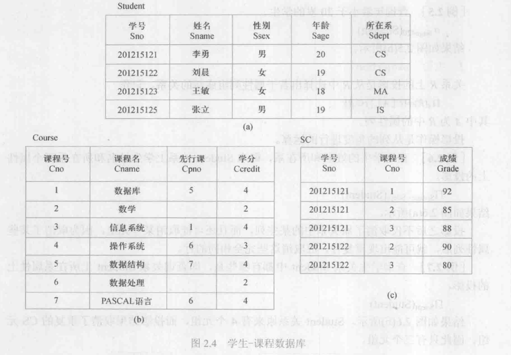

## 第3章 关系数据库标准语言SQL     
[TOC]

- 结构化查询语言(SQL)是关系数据库的标准语言，也是一个通用的、功能极强的关系数据库语言    
### 3.1 SQL概述  
- 大多数数据库均用SQL作为共同的数据存取语言和标准接口，使不同数据库之间的互操作有了共同的基础    
#### 3.1.1 SQL的产生和发展  
- SQL是在1974年由Boyce和Chamberlin提出，最初叫Sequel，并在IBM公司研制的关系数据库管理系统原型System R上实现。  
- 1987年，国际化组织通过了SQL这一标准，从标准公布以来岁数据库的发展也在不断的发展和丰富  
- 目前，没有一个数据库系统能够支持SQL标准的所有概念和特性  
- 许多软件厂商对SQL基本命令集还进行不同程度的扩充和修改，又可以支持标准以外的功能特性  
#### 3.1.2 SQL的特点  
- SQL是一个综合的、功能极强同时又简洁易学的语言。集数据查询、数据操纵、数据定义和数据控制功能于一体包括以下特点：
	1. 综合统一 
		- 非关系模型的数据语言一般分为：模式数据定义语言、外模式定义语言、数据存储有关的描述语言、数据操纵语言。数据库投入运行，若要修改模式，必须停止现有数据库运行，转储数据，修改编译再重装数据库  
		- SQL操作要求：定义和修改、删除关系模式，定义和删除视图，插入数据，建立数据库；查询和更新；数据库重构与维护；数据库安全性完整性以及事务控制；嵌入式SQL和动态SQL定义，投入运行还可以随时、逐步修改模式不影响数据库运行  
		- 关系型数据库实体和实体间的关系均用关系表示，这种数据结构的单一性带来了数据操作符号的统一性，每种操作只需一种操作符  
	2. 高度非过程化  
		- 非关系数据模型操纵语言是面向过程的语言，完成操作必须指明存储路径  
		- SQL进行数据操作，只要提出”做什么“，无需指明”怎么做“，因此无需了解存取路径，有利于提高数据独立性  
	3. 面向集合的操作方式  
		- 非关系型模型采用的是面向记录的操作方式  
		- SQL采用集合操作方式  
	4. 以同一种语法结构提供多种使用方式   
		- SQL既是独立的语言，有事嵌入式语言  
		- 作为独立语言，能够独立用于联机交互  
		- 作为嵌入式语言，SQL能够嵌入到高级语言(例如：C、C++、Java)程序中，供程序员设计程序时使用  
	5. 语言简单，易学易用  
		- 完成核心功能只需9个动词  

SQL功能|动词
-|- 
数据查询|SELECT
数据定义|CREATE,DROP,ALTER
数据操纵|INSERT,UPDATE,DELETE
数据控制|GRANT,REVOKE

#### 3.1.3 SQL的基本概念  
- 支持SQL的关系数据库管理系统三级模式结构  
	- 外模式：若干视图和部分基本表  
	- 模式：若干基本表  
	- 内模式：若干存储文件 
- SQL对基本表和视图进行查询或其他操作，基本表和视图一样，都是关系   
- 基本表是本身独立存在的表，一个或多个基本表对应一个存储文件  
- 视图是从一个或几个基本表导出表。它本身不独立存储在数据库中，即数据库中只存放视图的定义而没有对应的数据  
	- 视图的数据仍存放导出视图的基本表中，因此视图是一个虚表  
### 3.2 学生-课程数据库  
- 以学生-课程数据库为例来讲解SQL的数据定义、数据操纵、数据查询和数据控制语句。  
	- 学生表：Student(<u>Sno</u>,Sname,Ssex,Sage,Sdept)   
	- 课程表：Course(<u>Cno</u>,Cname,Cpno,Ccredit)   
	- 学生选课表：SC(<u>Sno,Cno</u>,Grade)  
  

### 3.3 数据定义  
- 关系数据库系统支持三级模式结构、其模式、外模式和内模式中的基本对象有模式、表、视图和索引等，因此SQL的数据定义功能包括：模式定义、表定义、视图和索引的定义   

操作对象|创建|删除|修改
-|-|-|-
模式|CREATE SCHEMA|DROP SCHEMA| 
表|CREATE TABLE|DROP TABLE|ALTER TABLE
视图|CREATE VIEW|DROP VIEW
索引|CREATE INDEX|DROP INDEX|ALTER INDEX
数据库|CREATE DATABASE|DROP DATABASE|  

- SQL不提供修改模式定义和修改视图定义操作。用户想修改这些对象，只能先删除再重建  
- 目前，一个关系数据库管理系统的实例中可以建立多个数据库，一个数据库可以建立多个模式，一个模式下通常包括多个表、视图和索引等数据库对象 

#### 3.3.1 模式的定义与删除
1. 定义模式  
```SQL 
	create schema <模式名> authorization<用户名>  
	-- schema 英 /ˈskiːmə/  美 /ˈskiːmə/ n. [计][心理] 模式；计划；图解；概要 
	-- authorization 英 /ˌɔːθəraɪˈzeɪʃn/ 美 /ˌɔːθərəˈzeɪʃn/  n. 授权，认可；批准，委任 
```

- - 定义模式实际上定义了一个命名空间，在这个空间可以进一步定义该模式包含的数据库对象，例如：基本表、视图、索引等，因此，模式定义可写为：  
```SQL
	create schema <模式名> authorization<用户名>
	[<表定义子句>|<视图定义子句>|<授权定义子句>]
	-- ”[]“中代表的是可有可无  
```

2. 删除模式   
```SQL
	drop schema <模式名><cascade|restrict>;
	-- cascade 英 /kæˈskeɪd/  美 /kæˈskeɪd/  n. 小瀑布，瀑布状物；串联   vi. 像瀑布般大量倾泻下来   vi. 像瀑布般悬挂着   
	-- restrict 英 /rɪˈstrɪkt/  美 /rɪˈstrɪkt/   vt. 限制；约束；限定  
```

- - cascade和restrict两者必选其一  
- - 选择了cascade(级联)，表示在删除模式的同时把该模式中所有数据库对象全部删除   
- - 选择了restrict(限制)，表示如果该模式已经定义了下属的数据库对象(如表、视图等)，则拒绝该删除语句执行，只有当该模式中没有下属对象时才能执行`drop schema`语句   

#### 3.3.2 基本表的定义、删除与修改   
1. 定义基本表  
	- 创建一个模式就建立了一个数据库的命名空间，一个框架。   
	- 在这个空间中首先要定义的是该模式包含的数据库基本表  
```SQL
	create table <表名> (<列名><数据类型>[列级完整性约束条件]
				[,<列名><数据类型>[列级完整性约束条件]]
				...
				[,<表级完整性约束条件>]);  
```

- - 建表时还可以定义完整性约束条件，这些约束条件被存入数据词典中，当用户操作表中表中数据时数据库管理系统自动检查，是否满足约束      
- - 如果完整性约束条件涉及该表多个属性列，必须定义在表级上，否则既可以定义在表级也可以定义在列级  

```SQL
	create table Course 
		(Cno char(4) primary key,
		Cname char(40) not null,
		Cpno char(4),
		Ccredit smallint,
		foreign key(Cpno) references Course(Cno)
		);
```

2. 数据类型  
	- 每一个属性来自一个域，它的取值必须是域中的值  
	- 在SQL中，域的概念用数据类型来实现   

数据类型|含义
-|- 
char(n),character(n)|长度为n的定长字符串  
varchar(n),charactervarying(n)|最大长度为n的变长字符串  
clob|字符串大对象
blob|二进制大对象
int，integer|长整型(4字节)
smallint|短整型(2字节)  
bigint|大整型(8字节)
float(n)|可选精度的浮点数，精度至少为n位数字
boolean|逻辑布尔量
date|日期，包含年月日，格式：YYYY-MM-DD  
time|时间，包含时分秒，格式：HH：MM：SS  

- - 一个属性属于哪种类型从两方面考虑：  
		- 取值范围  
		- 做哪些运算  

3. 模式与表  
	- 一个基本表都属于某一个模式，一个模式包含多个基本表   
	- 在模式`S-T`中定义基本表写法：  
		- 方法1：明显给出模式名 
```SQL
	create table "S-T".Student();
```

-	-   - 方法2：创建模式时，创建表   
```SQL
	create schema <模式名> authorization<用户名>
	<表定义子句>
```

-	-	- 方法3：设置所属的模式，这样创建表时，表名中不必给出模式名
```SQL
-- i. 用户创建表时，若没指定模式名，系统根据搜索路径来确定对象所属的模式  
-- ii. 搜索路径是一组模式列表，关系数据库管理系统会使用模式列表中第一个存在的模式作为数据库对象的模式名  
-- iii. 显示当前搜索路径语句，    
	show search_path;
-- iv. 搜索路径的当前默认值是 $user,PUBLIC :指的是优先搜索与用户名相同的模式名，如果该模式名不存在，则使用 PUBLI 模式  
-- v. 也可以设置搜索路径，再定义基本表      
	set search_path to "S-T",PUBLIC;
	create table Student(...);
-- 实际结果建立了S-T.Student基本表  
```

4. 修改基本表  
	- SQL语言用`alter table`语句修改基本表，一般格式：   
```SQL
	alter table <表名>
-- alter 英 /ˈɔːltə(r)/  美 /ˈɔːltər/ vt. 改变，更改  vi. 改变；修改
-- 添加新列、新的列级完整性约束条件  
	[add [column]<新列名><数据类型>[完整性约束]]
	[add <表级完整性约束>]
-- 删除表中的列，可以级联删除，也可以限制条件删除
	[drop [column]<列名> [casade|restrict]]
	[drop constraint<完整性约束名> [restrict|casade]]
-- 修改原有的列定义(列名和数据类型)
	[alter column<列名><数据类型>];
-- 例如：
	alter table Student add Entrance date;
```

5. 删除基本表  
	- 当某个基本表不再需要时，可以用`drop table`语句删除它    
```SQL
-- 删除表可以级联删除，也可以限制条件删除
	drop table <表名> [restrict|cascade];
-- 例如：删除所有与Student相互引用和视图、索引一并删除
	drop table Student cascade;
```

- :pencil:`restrict`表示删除是有限制条件的，删除的基本表不能被其他表的约束所引用(check、foreign key等约束)，不能有视图，不能有触发器、存储过程或函数等。  
- :pencil:`cascade`表示该表的删除没有限制条件。在删除基本表的同时，相关依赖对象一并删除  

#### 3.3.3 索引的建立与删除   
- 建立索引是加快查询速度的有效手段。
- 建立索引有多种类型    
	- 顺序文件上的索引  
	- B+树索引  
	- 散列索引   
	- 位图索引   
- 索引可以加速数据库查询，但占一定存储空间，应根据实际需要，有选择的创建索引  
- 用户不必也不能显式的选择索引，索引属于内模式范畴  
1. 建立索引  
```SQL
	create [unique][cluster] index<索引名>
	on <表名>(<列名> [<次序>][,<列名>[<次序>]]...);
-- <表名>是要建立索引的基本表名字  
-- 索引可以建立在一列上，或多列上，各列名之间用逗号分隔  
-- 列名后面还可以用<次序>指定索引的排列次序，asc(升序)，desc(降序)，默认是asc  
-- unique表明此索引的每一个索引值只对应唯一数据记录   
-- cluster后序第7章在解释   
-- cluster 英 /ˈklʌstə(r)/  美 /ˈklʌstər/   n. 群；簇；丛；串   vt. 使聚集；聚集在某人的周围   vi. 群聚；丛生   
-- 例如：  
	create unique index Stusno on Student(Sno asc, Cno desc);
```

2. 修改索引  
```SQL
	alter index <旧索引名> rename to <新索引名>;
```

3. 删除索引  
```SQL
	drop index <索引名>;
```

#### 3.3.4 数据字典  
- 数据字典是关系数据库管理系统内部的一组系统表，它记录了数据库中所有的定义信息，包括关系模式定义、视图定义、索引定义、完整性约束定义、各类用户对数据库操作权限、统计信息等   

