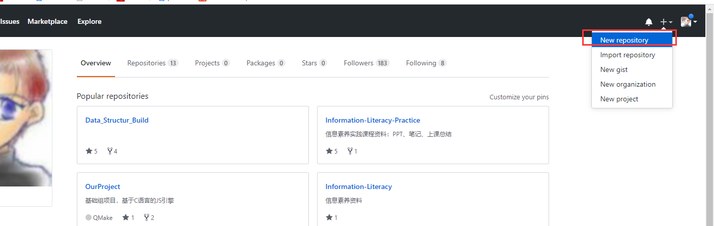
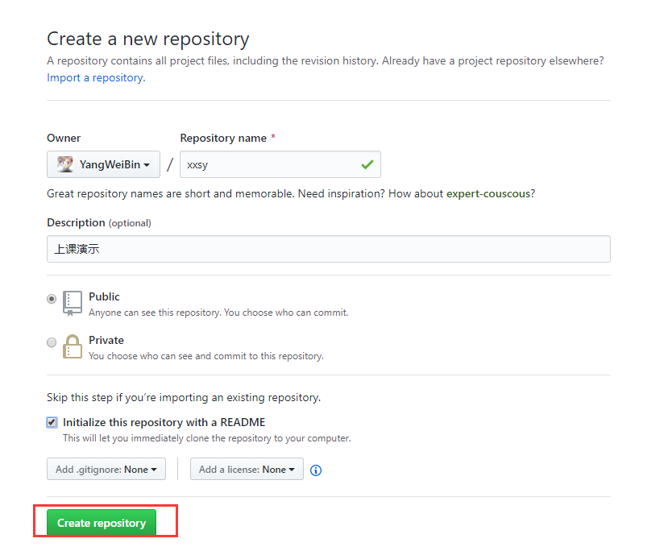
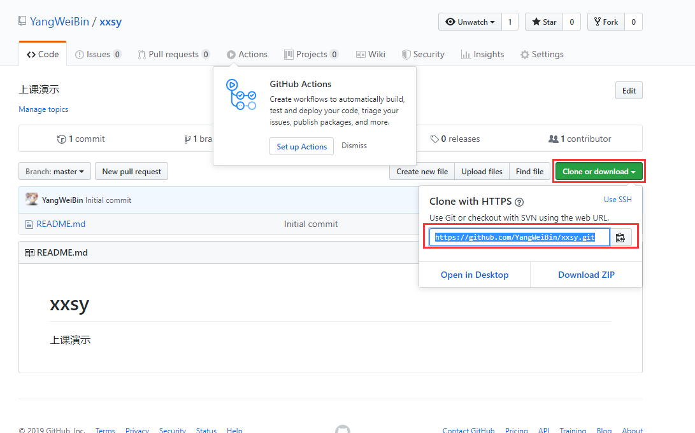
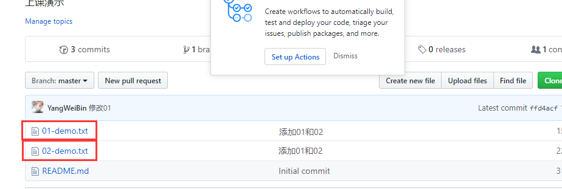
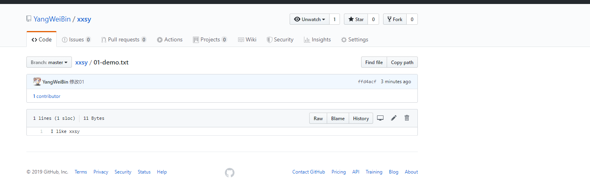

# Git命令简易使用手册  
## 1 配置用户信息           
### 1.1 输入配置命令          
```bash
# 显示当前的 Git 配置
git config --list
# 设置提交仓库时自己的用户名信息
git config --global user.name "YangWeiBin" 
# 设置提交仓库时的自己邮箱信息
git config --global user.email "863255386@qq.com"
```
### 1.2 验证配置是否正确          
打开`C:\Users\此处是用户名`找到`.gitconfig`文件，以记事本打开是否如下：
```
[user]
	name = YangWeiBin
	email = 863255386@qq.com
```

## 2 创建仓库   
### 2.1 进入Github登录账户    
- 打开浏览器，搜索github，进入github；   
### 2.2 创建仓库    
- 点击右上角的，新建仓库    
    
### 2.3 设置仓库信息  
1. 仓库名以`xxsy`命名   
2. 仓库描述：上课演示     
3. 仓库设置为公有仓库    
4. 初始化时包含README.md文件   
     

## 3 Git常用命令   
### 3.1 克隆到本地    
1. 选中仓库的`URL`复制   
     
2. 克隆到本地   
```shell
# url 格式: https://github.com/[userName]/reposName
git clone https://github.com/YangWeiBin/xxsy.git   
```
### 3.2 新建文件并提交暂存区        
1. 双击进入xxsy文件夹，鼠标右击，选择`Git Bash Here`    
2. 在工作区新建一个文件`01-demo.txt`，`02-demo.txt`然后添加暂存区    
```shell
git add 01-demo.txt 02-demo.txt
```
### 3.3 将文件由暂存区添加仓库       
```shell
git commit -m "添加01和02"
```
### 3.4 将仓库提交到Github       
```shell
git push
```
    
**第一次提交可能需要输入用户名，邮箱，密码等信息**    
### 3.5 修改文件并提交Github     
1. 打开`01-demo.txt`，添加：I like xxsy     
2. 保存，关闭     
3. 将修改内容添加到暂存区，并提交仓库    
```
git add 01-demo.txt
git commit -m "修改01"
```
4. 将修改后仓库，提交到Github   
```
git push
```
5. 查看github是否成功：    
     

## 4 Git其他命令   

#### 4.1 文件重命名      
```shell
git mv 01-demo.txt 01-demo.py 
```
#### 4.2 继续提交   
```shell
git commit -m "修改成*.py"
```
**注意：**每次修改文件信息都要提交

#### 4.3 删除文件   
```shell
# 删除文件
git rm 02-demo.txt
# 将删除文件信息提交仓库  
git commit -m "删除02"
```
**注意：**进一步说明仓库存放的是文件的修改信息，并不是文件本身  

#### 4.4 找回文件   
1. 查看历史版本   
```shell
# 查看历史版本  
git log --oneline
# 4497801 (HEAD -> master) 删除02
# 042943a 修改01名字为*.py
# ffd4acf (origin/master, origin/HEAD) 修改01
# 98f0454 添加01和02
# 9540d2f Initial commit
```
**注意：**越新提交的越靠前   
2. 根据版本号，拣出仓库   
```shell
# 拣出仓库，仓库回到 修改01的状态
git checkout ffd4acf
```


