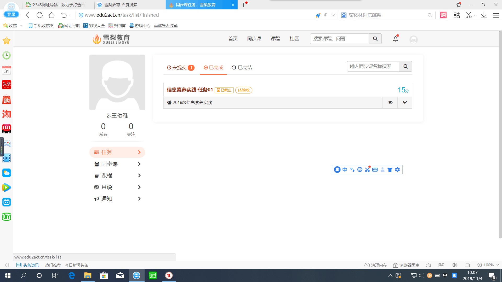

# 10 上课计划  
### 1.1 杂事       
- 判作业有问题的可以抓紧时间沟通   
- 下载并安装typroa   
- 因为发布任务太少，添加Markdown文档的部分   
- 百度网盘提速工具`PanDownLoad`    
- 有学生问我导论的题目    


### 1.2 回顾上节课内容        
[Class09](../course-summary/Class09-20191101.txt)       
```
## 09-20191028        
1. DOS命令——其他操作（cls、date、format、ipconfig）   （理解、掌握）    
2. 认识文件三要素：文件存放路径、文件保存属性、文件类型    （理解、掌握）  
3. 规范命名——整理自己的电脑                           （了解）
4. 文件管理：查找、压缩与解压、设置密码                 （理解、掌握）
5. 修改自己电脑软件默认下载目录                        （了解）
```

### 1.3 学生遇到问题     
1. Office没有解锁       


## 2 移动互联网      
### 2.1 移动互联网的发展历程    
1. 移动通信的发展    
2. 5G时代     

### 2.2 移动互联网的热点应用分享    
1. 手机浏览器：QQ浏览器、谷歌浏览器、火狐浏览器、UC浏览器     
2. 无线手机应用：聊天、音乐、视频、杀毒等     
3. 热点应用——社交      
4. 热点应用——微博    
5. 热点应用——搜索    
6. 热点应用——支付    
7. 热门应用——微信、抖音、电商     

### 2.3 关注我的新浪微博   
- 整理一下自己的电脑文件      
- 关注我的微博    
- 关注我的抖音    
- 创建一个微信群  
- 电商买双袜子    

## 3 Markdown文档基本语法   
### 3.1 标题   
```
# 标题样式  
## 标题2  
### 标题3  
#### 标题4  
##### 标题5  
###### 标题6    
```

### 3.2 基本语法  
文字  
**文字**   
_文字_  
***文字***  
~~文字~~   
<u>文字</u>  

### 3.2 链接   
    
    

[百度](https://www.baidu.com)    

### 3.3 插入代码   
```python
print("Hello");
```
`print`这个是打印函数   

学号|姓名|语文成绩
-:|:-:|:-
001|杨伟彬|90
003|张三|80


### 3.4 列表   
1. 观点1；   
2. 观点2；  
3. 观点3。  

---


- 观点1；  
+ 观点2；  
+ 观点3；  
* 观点3；   


## 4 课下作业   
- 发布一次和Markdown有关的雪梨任务    


